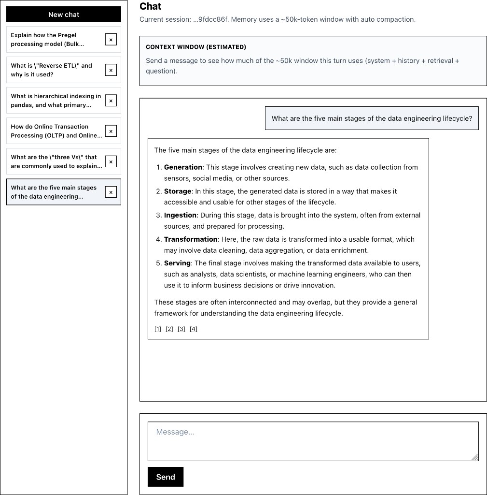
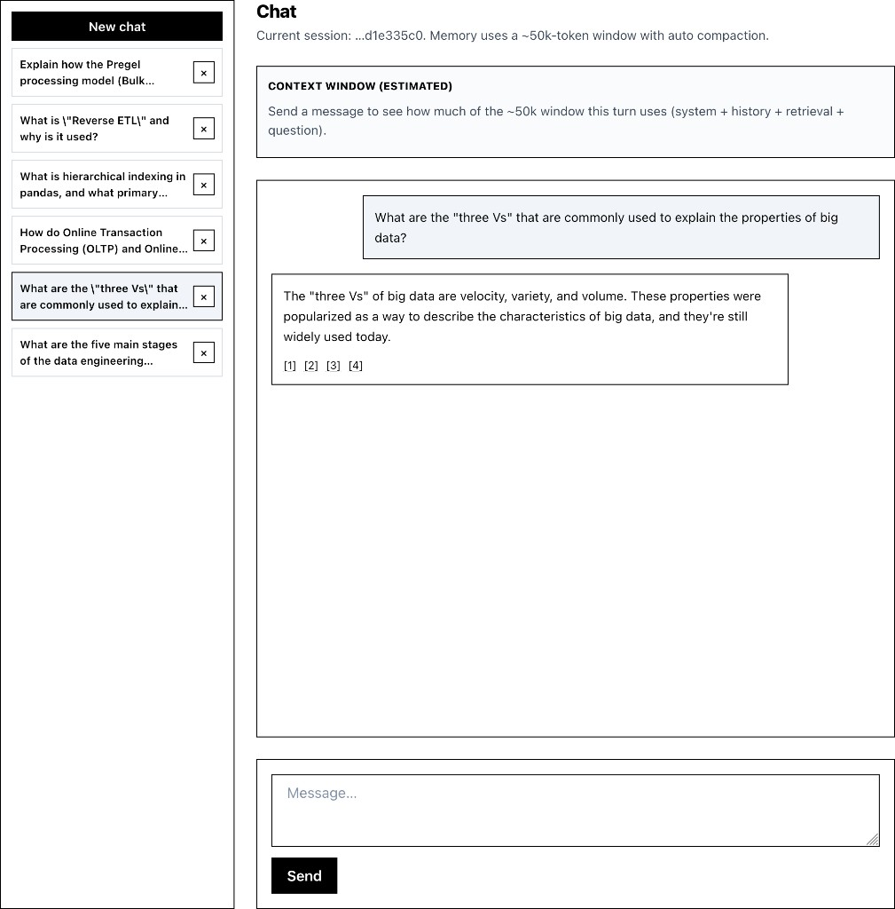
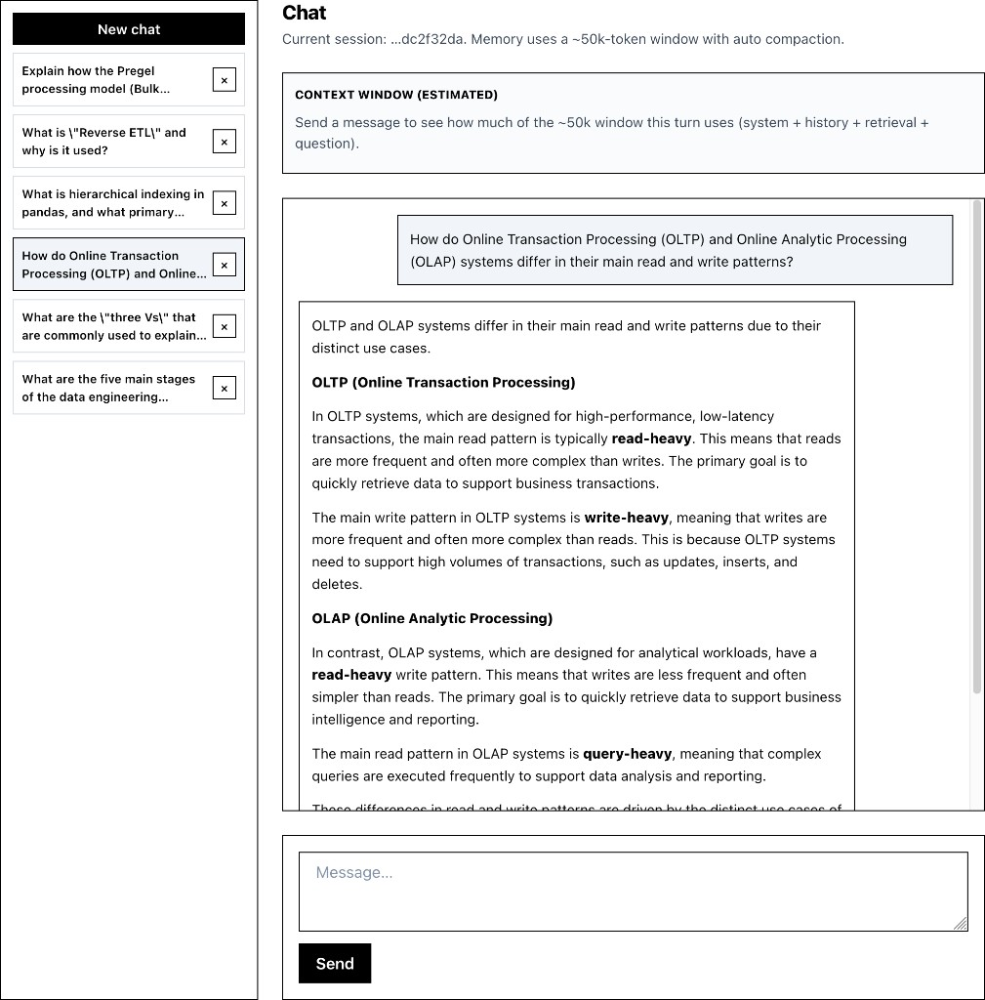
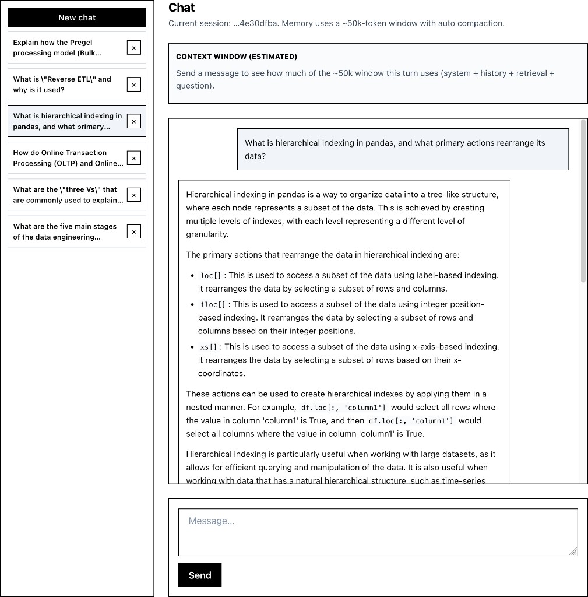
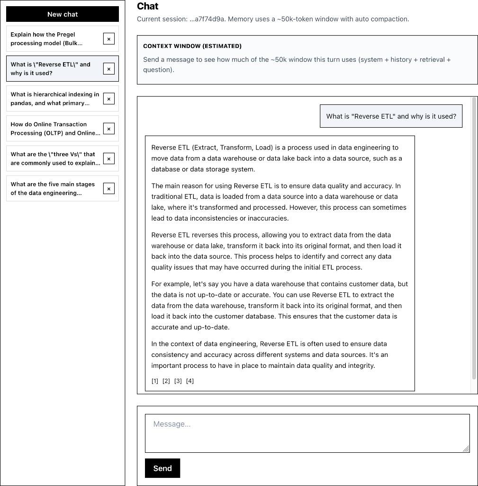

# Manual test results

| #   | Question (short)                 | Expected (summary)                                                                                                                                     | Model answer (summary)                                                                                                                             | Retrieved context sufficient? | Notes                                                                                               |
| --- | -------------------------------- | ------------------------------------------------------------------------------------------------------------------------------------------------------ | -------------------------------------------------------------------------------------------------------------------------------------------------- | ----------------------------- | --------------------------------------------------------------------------------------------------- |
| 1   | Five stages of lifecycle         | Should list generation, storage, ingestion, transformation, serving.                                                                                   | Model listed all five stages and gave short explanations for each.                                                                                 | Yes                           | Good grounded answer; matched the expected stage list closely.                                      |
| 2   | Three Vs of big data             | Should identify volume, variety, velocity.                                                                                                             | Model answered with velocity, variety, and volume.                                                                                                 | Yes                           | Correct and concise.                                                                                |
| 3   | OLTP vs OLAP read/write patterns | OLTP should emphasize small key-based reads and low-latency transactional writes; OLAP should emphasize large aggregations and batch or stream writes. | Model contrasted OLTP and OLAP but drifted into generic read-heavy and write-heavy wording instead of the more precise access-pattern distinction. | Partial                       | Answer is directionally useful but less precise than the source material.                           |
| 4   | Hierarchical indexing in pandas  | Should define multi-level indexing and mention `stack` / `unstack` as the primary rearrangement actions.                                               | Model described hierarchical indexing loosely, then incorrectly focused on `loc[]`, `iloc[]`, and `xs[]` as the main rearrangement actions.        | No                            | Clear factual miss; retrieval likely did not anchor strongly enough on the relevant pandas section. |
| 5   | Reverse ETL purpose              | Should describe moving processed warehouse data back into operational systems or SaaS tools to drive actions.                                          | Model defined Reverse ETL as moving data back into source systems for data quality correction and restoring original format.                       | No                            | Incorrect framing; answer confuses activation use cases with a data repair loop.                    |

## Test environment

- Date: 2026-04-05
- `chunk_size` / `chunk_overlap` / `top_k`: `1000 / 150 / 4`
- Embedding model: `nomic-embed-text`
- LLM model: `llama3.2`

## Screenshots And Ground Truth

### 1. Five stages of lifecycle

Dataset correct answer:

The data engineering lifecycle consists of five stages: generation, storage, ingestion, transformation, and serving.

### 2. Three Vs of big data

Dataset correct answer:

The three Vs of big data are volume (massive data size), variety (heterogeneous data sources like text, photos, and video), and velocity (continuous, live data collection).

### 3. OLTP vs OLAP read/write patterns

Dataset correct answer:

OLTP systems typically read a small number of records fetched by key and experience random-access, low-latency writes from user input. In contrast, OLAP systems aggregate over large numbers of records for their reads and handle writes via bulk imports or event streams.

### 4. Hierarchical indexing in pandas

Dataset correct answer:

Hierarchical indexing enables multiple index levels on an axis, allowing users to work with higher dimensional data in a lower dimensional form. The two primary actions to rearrange this data are `stack` (which pivots columns into rows) and `unstack` (which pivots rows into columns).

### 5. Reverse ETL purpose

Dataset correct answer:

Reverse ETL is the process of taking processed data, analytics, or scored models from the output side of the data engineering lifecycle and feeding it back into source systems or production SaaS platforms. It is used to drive actions in production, such as pushing calculated cost-per-click bids back into an advertising platform like Google Ads.

